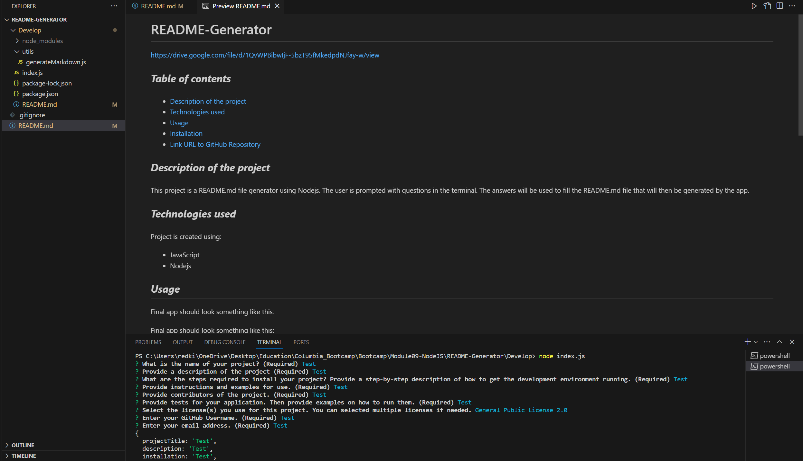

# README-Generator

## **_Table of contents_**
* [Description of the project](#description-of-the-project)
* [Technologies used](#technologies-used)
* [Usage](#usage)
* [Installation](#installation)
* [Link URL to GitHub Repository](#link-URL-to-GitHub-repository)

## **_Description of the project_**
This project is a README.md file generator using Nodejs. The user is prompted with questions in the terminal. The answers will be used to fill the README.md file that will then be generated by the app.

## **_Technologies used_**
Project is created using:
* JavaScript
* Nodejs

## **_Usage_**
Final app should look something like this:

[![Watch the video]](https://drive.google.com/file/d/1QvWPBibwIjF-5bzT9SfMkedpdNJfay-w/view)




## **_Installation_**
Here are some guidelines for installing the project on your local machine in order to be able to try it: 

1. Since Node.js applications don't have a front end, clone or download the repository to your own local machine and run it from your command line.

2. Change the working directory to ```cd Develop/```

3. Run ```npm i``` to download all the dependencies. 

4. Run ```node index.js``` in your terminal to launch the application, the first question will appear in your terminal. 

5. Enjoy and don't hesitate to contribute! 🙂

## **_Link URL to GitHub Repository_**
https://github.com/KateRedkina/README-Generator